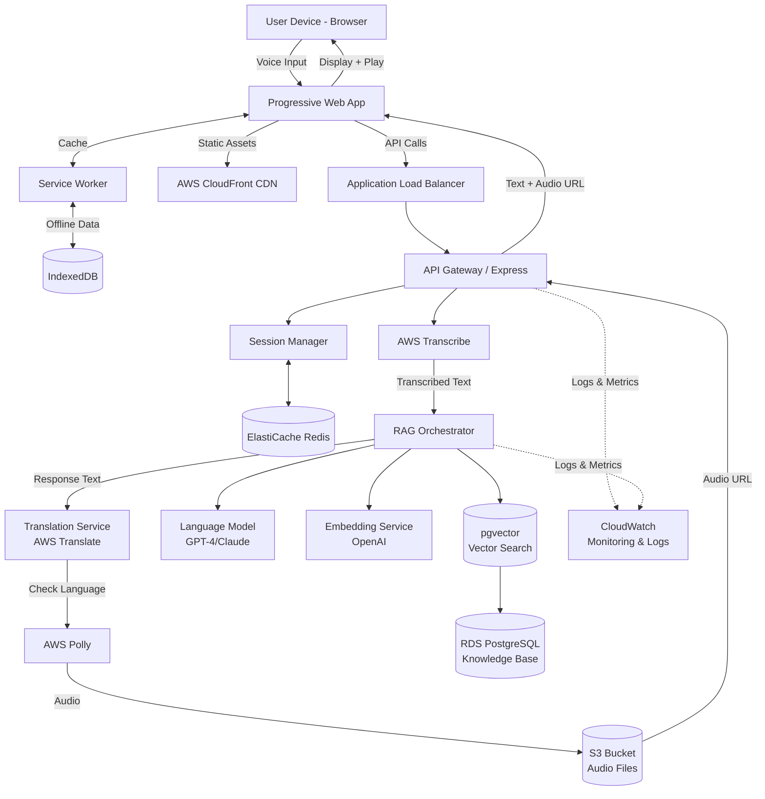

# Design Document: AI-Powered Multilingual Civic Information Assistant

## Overview

The AI-Powered Multilingual Civic Information Assistant is a voice-first web application that enables Indian citizens to access government scheme information through natural language conversations in their regional languages. The system follows a Retrieval-Augmented Generation (RAG) architecture, combining cloud-based speech services, AI language models, and a curated knowledge base to deliver accurate, personalized responses in both text and voice formats.

**Language Support Strategy**: While Amazon Transcribe supports multiple Indian languages (Hindi, Tamil, Telugu, Kannada, Malayalam), Amazon Polly currently supports limited Indian language voices (Hindi, Tamil). Therefore, the system includes a translation layer to convert responses into supported voice languages when necessary. Users receive text in their original language while hearing voice output in a supported language (typically Hindi). In future iterations, native multilingual TTS models will be integrated to eliminate this translation step.

### Key Design Principles

1. **Voice-First Experience**: Prioritize voice interaction with text as a complementary output
2. **Multilingual by Default**: Support multiple Indian regional languages without requiring explicit language selection
3. **Offline Resilience**: Enable core functionality even with intermittent connectivity
4. **Simplicity**: Abstract technical complexity behind a conversational interface
5. **Accessibility**: Ensure usability for users with varying abilities and digital literacy levels
6. **Privacy**: Minimize data collection and ensure secure handling of user information

### Technology Stack

- **Frontend**: Progressive Web App (PWA) using React with TypeScript
- **Speech Services**: AWS Transcribe (Speech-to-Text) for Hindi, Tamil, Telugu, Kannada, Malayalam; AWS Polly (Text-to-Speech) with translation layer for unsupported languages
- **Translation Service**: AWS Translate or LLM-based translation for converting responses to Polly-supported languages
- **AI Model**: OpenAI GPT-4 or Anthropic Claude with LangChain for RAG orchestration
- **Knowledge Base**: PostgreSQL with pgvector for semantic search
- **Caching Layer**: Redis for session management and frequently accessed data
- **Offline Storage**: IndexedDB for client-side caching
- **Backend**: Node.js with Express for API orchestration
- **Deployment**: AWS (Lambda/ECS, RDS, S3, CloudFront, ElastiCache)

## Architecture

### High-Level Architecture

The system follows a microservices architecture deployed on AWS, with clear separation between frontend (PWA), API layer, orchestration services, and data storage. The architecture is designed for horizontal scalability, fault tolerance, and low-latency responses even on 2G/3G networks.



### Detailed Workflow Explanation

#### 1. User Query Initiation (Voice Input)
- User clicks voice button in PWA interface
- Browser requests microphone permission (if not already granted)
- PWA captures audio stream using Web Audio API
- Visual feedback shows recording status (waveform animation)
- User speaks query in their preferred language (Hindi/Tamil/Telugu/Kannada/Malayalam)
- Audio is compressed to 16 kbps in low bandwidth mode
- Compressed audio blob sent to API Gateway via HTTPS

#### 2. Speech-to-Text Processing
- API Gateway receives audio blob and validates request
- Audio forwarded to AWS Transcribe with language hint (if available from session)
- AWS Transcribe processes audio and returns:
  - Transcribed text
  - Detected language code (hi-IN, ta-IN, te-IN, kn-IN, ml-IN)
  - Confidence score (0-1)
- If confidence < 0.7, user prompted to repeat query
- Transcribed text displayed to user for confirmation
- Language preference stored in session (Redis cache)

#### 3. Session Management & Context Retrieval
- Session Manager checks Redis for existing session
- If new user, creates session with unique ID
- Retrieves conversation history (last 5 turns) for context
- Stores current query in conversation history
- Session data includes:
  - User language preference
  - Location, occupation, age (if provided)
  - Previous queries and responses
  - Cached scheme IDs

#### 4. RAG Pipeline - Query Processing

**Step 4a: Query Embedding**
- Transcribed text sent to RAG Orchestrator
- Orchestrator calls OpenAI Embeddings API
- Text converted to 1536-dimensional vector
- Embedding cached in Redis for 1 hour

**Step 4b: Intent Classification**
- LLM analyzes query to determine intent:
  - Scheme inquiry (general information)
  - Eligibility check (am I eligible?)
  - Application process (how to apply?)
  - Document requirements (what documents needed?)
  - Contact information (helpline numbers)
- Extracts entities: scheme names, locations, demographics
- If intent ambiguous (confidence < 0.6), generates clarifying questions

**Step 4c: Semantic Search**
- Query embedding sent to pgvector database
- Vector similarity search using cosine distance
- Filters applied based on:
  - User location (state/district)
  - User demographics (age, occupation, income)
  - Scheme category (agriculture, health, education, etc.)
- Top 5 most relevant schemes retrieved
- Relevance scores calculated (0-1)

**Step 4d: Context Retrieval**
- Full scheme details fetched from PostgreSQL
- Includes: name, description, eligibility, benefits, application steps, documents, contact info
- Scheme data available in all 5 languages (pre-translated)
- Retrieved context formatted for LLM prompt

#### 5. Response Generation

**Step 5a: Prompt Construction**
- System prompt defines assistant role and guidelines
- User context injected (language, location, demographics)
- Retrieved scheme information added as context
- Conversation history included for multi-turn coherence
- Prompt instructs LLM to:
  - Respond in user's language
  - Use simple, conversational language
  - Limit response to 200 words for voice
  - Structure response with clear sections

**Step 5b: LLM Inference**
- Prompt sent to GPT-4 or Claude API
- LLM generates personalized response in user's language
- Response includes:
  - Overview of relevant schemes
  - Eligibility criteria specific to user
  - Benefits summary
  - Application process steps
  - Required documents
  - Contact information
- Response validated for length and structure

**Step 5c: Post-Processing**
- Response text cleaned (remove markdown, special chars)
- Sections extracted (overview, eligibility, benefits, etc.)
- Related schemes identified for "See also" section
- Sources cited with scheme IDs and relevance scores

#### 6. Translation Layer (for Voice Output)

**Step 6a: Language Support Check**
- System checks if user's language supported by AWS Polly
- Supported: Hindi (hi-IN), Tamil (ta-IN)
- Unsupported: Telugu (te-IN), Kannada (kn-IN), Malayalam (ml-IN)

**Step 6b: Translation (if needed)**
- If language unsupported, response translated to Hindi
- AWS Translate used for fast translation
- Government scheme terminology preserved using custom glossary
- Translation cached in Redis for common phrases
- Translation quality score calculated

**Step 6c: User Notification**
- If translation applied, user notified: "Text in [Original Language], Voice in Hindi"
- User can change voice language preference in settings
- Original language text always displayed

#### 7. Voice Synthesis
- Response text (original or translated) sent to AWS Polly
- Neural voice selected based on language:
  - Hindi: Aditi (female) or Kajal (female)
  - Tamil: Available neural voice
- Voice configuration applied (speed: 1.0x, pitch: 0)
- Polly generates audio file (MP3 format)
- Audio file stored in S3 bucket with 24-hour expiration
- Signed URL generated for secure access
- Audio URL returned to API Gateway

#### 8. Response Delivery (Multimodal)
- API Gateway packages response:
  - Response text (original language)
  - Audio URL (S3 signed URL)
  - Audio language (may differ from text)
  - Translation applied flag
  - Related schemes
  - Sources
- Response sent to PWA via HTTPS
- PWA displays text immediately
- PWA fetches and plays audio automatically
- Text highlighted as audio plays (word-level sync)

#### 9. Offline Mode Handling

**Scenario A: User Goes Offline Mid-Session**
- Service Worker detects offline status
- Notification shown: "You're offline. Showing cached results."
- User can browse previously viewed schemes from IndexedDB
- New queries queued in IndexedDB
- When online, queued queries processed automatically

**Scenario B: User Starts Session Offline**
- PWA loads from Service Worker cache
- Top 100 popular schemes available offline
- Basic keyword search works on cached data
- Voice input disabled (requires cloud services)
- Text input enabled for offline search

#### 10. Caching Strategy

**Redis Cache (Server-Side)**
- Session data: 30-minute TTL
- Frequently accessed schemes: 24-hour TTL
- Query embeddings: 1-hour TTL
- Translation cache: 7-day TTL
- Rate limiting counters: 1-minute TTL

**IndexedDB Cache (Client-Side)**
- Top 100 schemes: Updated daily
- User's viewed schemes: Persistent
- Queued requests: Until synced
- User preferences: Persistent
- LRU eviction when quota exceeded

### Scalability Architecture

#### Horizontal Scaling
- **API Gateway**: Deployed on AWS Lambda or ECS with auto-scaling
  - Scales from 10 to 1000 instances based on request volume
  - Target: 100 requests per instance
  - Cold start optimized: < 500ms
  
- **RAG Orchestrator**: Separate Lambda functions or ECS tasks
  - Scales independently from API layer
  - Handles 10-100K requests per minute
  - Async processing for non-critical operations

- **Database**: PostgreSQL with read replicas
  - Primary instance for writes
  - 3 read replicas for queries
  - Connection pooling (max 100 connections per instance)
  - pgvector indexes optimized for fast similarity search

#### Load Balancing
- Application Load Balancer distributes traffic across API instances
- Health checks every 30 seconds
- Unhealthy instances removed automatically
- Session affinity not required (stateless API with Redis)

#### Geographic Distribution
- Multi-region deployment:
  - Primary: Mumbai (ap-south-1)
  - Secondary: Hyderabad (ap-south-2)
- CloudFront CDN for static assets (global edge locations)
- Route 53 for DNS with latency-based routing
- Cross-region replication for S3 audio files

#### Performance Optimization
- **Caching**: Redis reduces database load by 70%
- **CDN**: CloudFront serves static assets with < 50ms latency
- **Connection Pooling**: Reuses database connections
- **Async Processing**: Non-critical tasks (analytics, logging) processed asynchronously
- **Compression**: Gzip compression for API responses
- **Audio Optimization**: 16 kbps audio in low bandwidth mode

### Security Architecture

#### Data Encryption
- **In Transit**: TLS 1.3 for all API communications
- **At Rest**: 
  - RDS encrypted with AWS KMS
  - S3 buckets encrypted (AES-256)
  - Redis encrypted in transit and at rest

#### Authentication & Authorization
- **User Authentication**: Optional (anonymous access allowed)
- **Admin Authentication**: JWT tokens with 1-hour expiration
- **API Keys**: Required for admin endpoints
- **AWS IAM**: Role-based access control for services
  - Lambda execution roles with least privilege
  - S3 bucket policies restrict access
  - RDS security groups limit database access

#### Data Privacy
- **Voice Recordings**: Deleted within 24 hours of processing
- **PII Anonymization**: User queries anonymized before logging
- **Session Data**: Encrypted in Redis, expires after 30 minutes
- **Compliance**: Digital Personal Data Protection Act 2023 (India)
- **Data Residency**: All data stored in Indian AWS regions

#### Security Monitoring
- **AWS GuardDuty**: Threat detection for AWS accounts
- **CloudWatch Alarms**: Alert on suspicious activity
- **VPC Flow Logs**: Network traffic monitoring
- **WAF**: Web Application Firewall protects against common attacks
  - SQL injection prevention
  - XSS protection
  - Rate limiting (100 requests per minute per IP)
  - Geographic restrictions (India-only access)

#### Vulnerability Management
- **Dependency Scanning**: Automated scans for vulnerable packages
- **Penetration Testing**: Quarterly security audits
- **Security Patches**: Applied within 48 hours of release
- **Secrets Management**: AWS Secrets Manager for API keys

### Disaster Recovery & High Availability

#### Backup Strategy
- **Database**: Automated daily backups with 30-day retention
- **Point-in-Time Recovery**: 5-minute granularity
- **Cross-Region Backup**: Replicated to secondary region

#### Failover Mechanism
- **RTO (Recovery Time Objective)**: 2 hours
- **RPO (Recovery Point Objective)**: 15 minutes
- **Automated Failover**: Route 53 health checks trigger failover
- **Manual Failover**: Documented runbooks for disaster scenarios

#### Circuit Breakers
- External service calls (Polly, Transcribe, LLM) have circuit breakers
- After 5 consecutive failures, circuit opens for 60 seconds
- Fallback mechanisms:
  - Polly failure → Display text only
  - Transcribe failure → Offer text input
  - LLM failure → Template-based responses
  - Database failure → Serve cached data

### Monitoring & Observability

#### Metrics (CloudWatch)
- Request rate, latency, error rate
- Database query performance
- Cache hit/miss ratio
- Speech service success rate
- Translation layer latency
- User engagement metrics

#### Logging (CloudWatch Logs)
- Structured JSON logs
- Request/response logging (anonymized)
- Error stack traces
- Performance traces
- Audit logs for admin actions

#### Alerting
- Error rate > 5% → Page on-call engineer
- Latency > 10 seconds → Warning alert
- Database CPU > 80% → Scale up alert
- Disk space > 85% → Critical alert

#### Distributed Tracing
- AWS X-Ray for end-to-end request tracing
- Trace IDs propagated across services
- Performance bottleneck identification

## Components and Interfaces

### 1. Progressive Web App (Frontend)

**Responsibilities**:
- Capture and stream audio from user's microphone
- Display transcribed text and generated responses
- Play synthesized voice output
- Manage offline caching through service worker
- Provide accessible UI with keyboard navigation and screen reader support

**Key Modules**:

#### VoiceInputComponent
```typescript
interface VoiceInputComponent {
  startRecording(): Promise<void>;
  stopRecording(): Promise<AudioBlob>;
  getAudioStream(): MediaStream;
  visualizeAudio(stream: MediaStream): void;
}
```

#### TranscriptionDisplay
```typescript
interface TranscriptionDisplay {
  showTranscription(text: string, language: string): void;
  confirmTranscription(): Promise<boolean>;
  editTranscription(text: string): void;
}
```

#### ResponseRenderer
```typescript
interface ResponseRenderer {
  displayResponse(response: Response): void;
  playAudio(audioUrl: string): Promise<void>;
  highlightText(currentWord: string): void;
  showRelatedSchemes(schemes: Scheme[]): void;
}
```

#### OfflineManager
```typescript
interface OfflineManager {
  cacheScheme(scheme: Scheme): Promise<void>;
  getCachedScheme(schemeId: string): Promise<Scheme | null>;
  queueRequest(request: Request): Promise<void>;
  syncWhenOnline(): Promise<void>;
}
```

### 2. API Gateway

**Responsibilities**:
- Route requests to appropriate services
- Handle authentication and rate limiting
- Manage session state
- Aggregate responses from multiple services

**Endpoints**:

```typescript
interface APIGateway {
  // Speech endpoints
  POST /api/speech/transcribe: (audio: AudioBlob) => Promise<TranscriptionResult>;
  POST /api/speech/synthesize: (text: string, language: string) => Promise<AudioBlob>;
  
  // Query endpoints
  POST /api/query: (query: QueryRequest) => Promise<QueryResponse>;
  GET /api/schemes/:id: (id: string) => Promise<Scheme>;
  GET /api/schemes/search: (params: SearchParams) => Promise<Scheme[]>;
  
  // Session endpoints
  POST /api/session/create: () => Promise<Session>;
  GET /api/session/:id: (id: string) => Promise<Session>;
  PUT /api/session/:id: (id: string, data: SessionData) => Promise<Session>;
  
  // Offline sync endpoints
  POST /api/offline/cache: () => Promise<CacheManifest>;
  POST /api/offline/sync: (queuedRequests: Request[]) => Promise<SyncResult>;
}
```

### 3. Session Manager

**Responsibilities**:
- Create and manage user sessions
- Store conversation context and user preferences
- Track language preferences and user demographics
- Implement session timeout and cleanup

**Interface**:

```typescript
interface SessionManager {
  createSession(): Promise<Session>;
  getSession(sessionId: string): Promise<Session | null>;
  updateSession(sessionId: string, updates: Partial<SessionData>): Promise<Session>;
  addToConversationHistory(sessionId: string, turn: ConversationTurn): Promise<void>;
  getConversationContext(sessionId: string, maxTurns: number): Promise<ConversationTurn[]>;
  expireSession(sessionId: string): Promise<void>;
}

interface Session {
  id: string;
  userId?: string;
  language: string;
  preferences: UserPreferences;
  conversationHistory: ConversationTurn[];
  createdAt: Date;
  lastActiveAt: Date;
  expiresAt: Date;
}

interface UserPreferences {
  language: string;
  location?: string;
  occupation?: string;
  age?: number;
  voiceSpeed: number;
}

interface ConversationTurn {
  role: 'user' | 'assistant';
  content: string;
  timestamp: Date;
  metadata?: Record<string, any>;
}
```

### 4. Speech Services Integration

**Responsibilities**:
- Convert audio to text using Google Cloud Speech-to-Text
- Detect language from audio input
- Synthesize natural-sounding speech from text
- Handle streaming audio for real-time processing

**Interface**:

```typescript
interface SpeechToTextService {
  transcribe(audio: AudioBlob, languageHint?: string): Promise<TranscriptionResult>;
  transcribeStreaming(audioStream: ReadableStream): AsyncIterator<PartialTranscription>;
  detectLanguage(audio: AudioBlob): Promise<LanguageDetectionResult>;
}

interface TextToSpeechService {
  synthesize(text: string, language: string, voiceConfig: VoiceConfig): Promise<AudioBlob>;
  getAvailableVoices(language: string): Promise<Voice[]>;
  isLanguageSupported(language: string): boolean;
}

interface TranslationService {
  translate(text: string, sourceLanguage: string, targetLanguage: string): Promise<string>;
  detectLanguage(text: string): Promise<string>;
}

interface TranscriptionResult {
  text: string;
  language: string;
  confidence: number;
  alternatives?: string[];
}

interface LanguageDetectionResult {
  language: string;
  confidence: number;
  alternatives: Array<{language: string; confidence: number}>;
}

interface VoiceConfig {
  gender?: 'male' | 'female' | 'neutral';
  speed: number; // 0.5 to 2.0
  pitch: number; // -20 to 20
}
```

**Supported Languages**:
- **Speech-to-Text (AWS Transcribe)**: Hindi (hi-IN), Tamil (ta-IN), Telugu (te-IN), Kannada (kn-IN), Malayalam (ml-IN)
- **Text-to-Speech (AWS Polly)**: Hindi (hi-IN), Tamil (ta-IN) - native support
- **Translation Layer**: Telugu, Kannada, Malayalam responses translated to Hindi for voice output
- **UI/Text**: All 5 languages supported natively
- **Fallback**: English (en-IN) for admin interface

### 5. RAG Orchestrator

**Responsibilities**:
- Coordinate the RAG pipeline from query to response
- Embed user queries for semantic search
- Retrieve relevant documents from vector database
- Construct prompts with retrieved context
- Generate responses using language model in user's language
- Coordinate translation for voice output when needed
- Post-process responses for clarity and personalization

**Interface**:

```typescript
interface RAGOrchestrator {
  processQuery(query: QueryRequest): Promise<QueryResponse>;
  embedQuery(text: string): Promise<number[]>;
  retrieveContext(embedding: number[], filters: SearchFilters): Promise<Document[]>;
  generateResponse(query: string, context: Document[], session: Session): Promise<string>;
  postProcessResponse(response: string, language: string): Promise<string>;
}

interface QueryRequest {
  text: string;
  language: string;
  sessionId: string;
  userContext?: UserContext;
}

interface QueryResponse {
  responseText: string;
  responseLanguage: string;
  audioUrl: string;
  audioLanguage: string; // May differ from responseLanguage if translated
  translationApplied: boolean;
  relatedSchemes: Scheme[];
  sources: Source[];
  confidence: number;
}

interface UserContext {
  location?: string;
  occupation?: string;
  age?: number;
  income?: string;
  gender?: string;
}

interface SearchFilters {
  location?: string;
  category?: string[];
  eligibility?: Record<string, any>;
  limit: number;
}
```

### 6. Translation Service

**Responsibilities**:
- Translate responses from unsupported Polly languages to supported ones
- Detect when translation is needed based on language support
- Maintain translation quality for government scheme terminology
- Cache common translations to reduce latency

**Interface**:

```typescript
interface TranslationService {
  translateForVoice(text: string, sourceLanguage: string): Promise<TranslationResult>;
  isPollySupported(language: string): boolean;
  getTargetVoiceLanguage(sourceLanguage: string): string;
}

interface TranslationResult {
  translatedText: string;
  targetLanguage: string;
  translationApplied: boolean;
  confidence: number;
}

// Language support mapping
const POLLY_SUPPORTED_LANGUAGES = ['hi-IN', 'ta-IN'];
const TRANSLATION_MAPPING = {
  'te-IN': 'hi-IN', // Telugu -> Hindi
  'kn-IN': 'hi-IN', // Kannada -> Hindi
  'ml-IN': 'hi-IN', // Malayalam -> Hindi
};
```

**Translation Strategy**:
- Use AWS Translate for fast, cost-effective translation
- Fallback to LLM-based translation for better context preservation
- Maintain glossary of government scheme terms to ensure consistency
- Cache translations for common phrases and scheme names

### 7. Vector Database and Knowledge Base

**Responsibilities**:
- Store scheme documents with semantic embeddings
- Perform fast similarity search for relevant schemes
- Maintain structured scheme metadata
- Support filtering by eligibility criteria

**Schema**:

```typescript
interface Scheme {
  id: string;
  name: string;
  nameTranslations: Record<string, string>; // language code -> translated name
  description: string;
  descriptionTranslations: Record<string, string>;
  category: SchemeCategory;
  eligibility: EligibilityCriteria;
  benefits: string[];
  applicationProcess: ApplicationStep[];
  requiredDocuments: string[];
  contactInfo: ContactInfo;
  officialUrl: string;
  lastUpdated: Date;
  embedding: number[]; // 1536-dimensional vector for semantic search
}

enum SchemeCategory {
  AGRICULTURE = 'agriculture',
  HEALTH = 'health',
  EDUCATION = 'education',
  FINANCE = 'finance',
  HOUSING = 'housing',
  EMPLOYMENT = 'employment',
  SOCIAL_WELFARE = 'social_welfare',
  SENIOR_CITIZEN = 'senior_citizen',
  WOMEN = 'women',
  DISABILITY = 'disability'
}

interface EligibilityCriteria {
  ageMin?: number;
  ageMax?: number;
  income?: {max?: number; min?: number};
  occupation?: string[];
  location?: string[]; // states/districts
  gender?: 'male' | 'female' | 'other' | 'all';
  category?: string[]; // SC/ST/OBC/General
  otherCriteria?: Record<string, any>;
}

interface ApplicationStep {
  stepNumber: number;
  description: string;
  descriptionTranslations: Record<string, string>;
  estimatedTime?: string;
}

interface ContactInfo {
  helplineNumber?: string;
  email?: string;
  website?: string;
  officeAddress?: string;
}
```

**Vector Search**:

```typescript
interface VectorDatabase {
  insertScheme(scheme: Scheme): Promise<void>;
  updateScheme(schemeId: string, updates: Partial<Scheme>): Promise<void>;
  searchSimilar(embedding: number[], filters: SearchFilters): Promise<Scheme[]>;
  getSchemeById(id: string): Promise<Scheme | null>;
  bulkInsert(schemes: Scheme[]): Promise<void>;
}
```

### 8. Language Model Integration

**Responsibilities**:
- Generate contextually appropriate responses
- Simplify complex bureaucratic language
- Personalize responses based on user context
- Handle multi-turn conversations
- Translate responses to user's preferred language

**Prompt Structure**:

```typescript
interface PromptBuilder {
  buildSystemPrompt(language: string): string;
  buildUserPrompt(query: string, context: Document[], userContext: UserContext): string;
  buildConversationPrompt(history: ConversationTurn[], currentQuery: string): string;
}

// Example system prompt template
const SYSTEM_PROMPT_TEMPLATE = `
You are a helpful civic information assistant for India. Your role is to help citizens understand and access government schemes and public services.

Guidelines:
- Provide accurate information based only on the context provided
- Use simple, conversational language appropriate for users with varying literacy levels
- Be empathetic and patient
- If information is not in the context, clearly state that you don't have that information
- Provide step-by-step guidance for application processes
- Highlight eligibility criteria clearly
- Respond in {language}

Context Documents:
{context}

User Profile:
{userContext}
`;
```

### 9. Service Worker and Offline Support

**Responsibilities**:
- Intercept network requests
- Implement caching strategies
- Queue failed requests for retry
- Sync data when connectivity restored
- Manage IndexedDB storage

**Caching Strategy**:

```typescript
interface CachingStrategy {
  // Cache-first for static assets
  cacheFirst(request: Request): Promise<Response>;
  
  // Network-first for API calls, fallback to cache
  networkFirst(request: Request): Promise<Response>;
  
  // Cache frequently accessed schemes
  cacheSchemes(schemes: Scheme[]): Promise<void>;
  
  // Background sync for queued requests
  backgroundSync(requests: Request[]): Promise<void>;
}

interface OfflineStorage {
  // Store schemes in IndexedDB
  storeScheme(scheme: Scheme): Promise<void>;
  getScheme(id: string): Promise<Scheme | null>;
  searchSchemes(query: string): Promise<Scheme[]>;
  
  // Queue management
  queueRequest(request: QueuedRequest): Promise<void>;
  getQueuedRequests(): Promise<QueuedRequest[]>;
  clearQueue(): Promise<void>;
}

interface QueuedRequest {
  id: string;
  url: string;
  method: string;
  body?: any;
  timestamp: Date;
  retryCount: number;
}
```

## Data Models

### Core Data Structures

#### Query Processing

```typescript
interface ProcessedQuery {
  originalText: string;
  language: string;
  intent: Intent;
  entities: Entity[];
  embedding: number[];
}

enum Intent {
  SCHEME_INQUIRY = 'scheme_inquiry',
  ELIGIBILITY_CHECK = 'eligibility_check',
  APPLICATION_PROCESS = 'application_process',
  DOCUMENT_REQUIREMENTS = 'document_requirements',
  CONTACT_INFO = 'contact_info',
  GENERAL_INFO = 'general_info'
}

interface Entity {
  type: EntityType;
  value: string;
  confidence: number;
}

enum EntityType {
  SCHEME_NAME = 'scheme_name',
  CATEGORY = 'category',
  LOCATION = 'location',
  AGE = 'age',
  OCCUPATION = 'occupation',
  INCOME = 'income'
}
```

#### Response Structure

```typescript
interface GeneratedResponse {
  text: string;
  language: string;
  sections: ResponseSection[];
  relatedSchemes: Scheme[];
  sources: Source[];
  confidence: number;
  suggestedFollowUps: string[];
}

interface ResponseSection {
  type: SectionType;
  content: string;
  metadata?: Record<string, any>;
}

enum SectionType {
  OVERVIEW = 'overview',
  ELIGIBILITY = 'eligibility',
  BENEFITS = 'benefits',
  APPLICATION = 'application',
  DOCUMENTS = 'documents',
  CONTACT = 'contact'
}

interface Source {
  schemeId: string;
  schemeName: string;
  relevanceScore: number;
  excerpt: string;
}
```

#### Analytics Events

```typescript
interface AnalyticsEvent {
  eventType: EventType;
  sessionId: string;
  timestamp: Date;
  language: string;
  metadata: Record<string, any>;
}

enum EventType {
  SESSION_START = 'session_start',
  QUERY_SUBMITTED = 'query_submitted',
  RESPONSE_GENERATED = 'response_generated',
  SCHEME_VIEWED = 'scheme_viewed',
  AUDIO_PLAYED = 'audio_played',
  ERROR_OCCURRED = 'error_occurred',
  OFFLINE_MODE = 'offline_mode',
  SESSION_END = 'session_end'
}
```

### Database Schema

#### PostgreSQL Tables

```sql
-- Schemes table
CREATE TABLE schemes (
  id UUID PRIMARY KEY,
  name VARCHAR(500) NOT NULL,
  name_translations JSONB,
  description TEXT,
  description_translations JSONB,
  category VARCHAR(50),
  eligibility JSONB,
  benefits JSONB,
  application_process JSONB,
  required_documents JSONB,
  contact_info JSONB,
  official_url VARCHAR(1000),
  last_updated TIMESTAMP,
  created_at TIMESTAMP DEFAULT NOW(),
  embedding vector(1536) -- pgvector extension
);

-- Create index for vector similarity search
CREATE INDEX ON schemes USING ivfflat (embedding vector_cosine_ops);

-- Sessions table
CREATE TABLE sessions (
  id UUID PRIMARY KEY,
  user_id UUID,
  language VARCHAR(10),
  preferences JSONB,
  conversation_history JSONB,
  created_at TIMESTAMP DEFAULT NOW(),
  last_active_at TIMESTAMP DEFAULT NOW(),
  expires_at TIMESTAMP
);

-- Analytics events table
CREATE TABLE analytics_events (
  id UUID PRIMARY KEY,
  event_type VARCHAR(50),
  session_id UUID REFERENCES sessions(id),
  timestamp TIMESTAMP DEFAULT NOW(),
  language VARCHAR(10),
  metadata JSONB
);

-- Scheme updates log
CREATE TABLE scheme_updates (
  id UUID PRIMARY KEY,
  scheme_id UUID REFERENCES schemes(id),
  updated_by VARCHAR(100),
  changes JSONB,
  updated_at TIMESTAMP DEFAULT NOW()
);
```

#### Redis Cache Structure

```typescript
// Session cache: session:{sessionId}
interface SessionCache {
  sessionId: string;
  language: string;
  preferences: UserPreferences;
  recentQueries: string[];
  ttl: number; // 30 minutes
}

// Frequently accessed schemes: scheme:{schemeId}
interface SchemeCache {
  scheme: Scheme;
  ttl: number; // 24 hours
}

// Rate limiting: ratelimit:{ip}
interface RateLimitCache {
  requestCount: number;
  windowStart: number;
  ttl: number; // 1 minute
}
```

#### IndexedDB Schema (Client-side)

```typescript
// Object stores
interface OfflineDatabase {
  schemes: {
    keyPath: 'id';
    indexes: ['category', 'lastUpdated'];
  };
  queuedRequests: {
    keyPath: 'id';
    indexes: ['timestamp'];
  };
  userPreferences: {
    keyPath: 'key';
  };
}
```


## Correctness Properties

A property is a characteristic or behavior that should hold true across all valid executions of a system—essentially, a formal statement about what the system should do. Properties serve as the bridge between human-readable specifications and machine-verifiable correctness guarantees.

### Property Reflection

After analyzing all acceptance criteria, I identified several areas where properties could be combined or where one property subsumes another:

- Properties about "sending to service" (1.2, 3.1, 6.1) can be combined into a general "service integration" property
- Properties about session persistence (2.4, 9.3) are redundant - one comprehensive property covers both
- Properties about error handling with notifications (1.4, 6.5, 12.5) follow the same pattern and can be unified
- Properties about UI state updates (1.1, 2.5) follow similar patterns but test different features, so both are kept
- Properties about data completeness (4.4, 5.4) test different aspects and should remain separate

### Voice Input and Speech Recognition Properties

**Property 1: Voice input activation triggers UI feedback**
*For any* user-initiated voice input action, the system should activate the microphone and display visual recording status indicators.
**Validates: Requirements 1.1**

**Property 2: Audio capture triggers transcription service call**
*For any* captured audio blob, the system should send it to the speech-to-text service for transcription.
**Validates: Requirements 1.2**

**Property 3: Transcription results are displayed**
*For any* transcription result returned from the speech service, the system should display the transcribed text to the user.
**Validates: Requirements 1.3**

**Property 4: Low-confidence transcription triggers retry prompt**
*For any* transcription with confidence below threshold or failure status, the system should prompt the user to repeat their query.
**Validates: Requirements 1.4**

### Language Detection and Processing Properties

**Property 5: Language detection processes all transcriptions**
*For any* transcribed text received, the system should perform language detection and return a detected language code.
**Validates: Requirements 2.1**

**Property 6: High-confidence language detection proceeds automatically**
*For any* language detection result with confidence above 80%, the system should proceed with processing in the detected language without user confirmation.
**Validates: Requirements 2.2**

**Property 7: Low-confidence language detection requests confirmation**
*For any* language detection result with confidence below 80%, the system should prompt the user to confirm their preferred language.
**Validates: Requirements 2.3**

**Property 8: Language preference persists across sessions**
*For any* user who sets a language preference, that preference should be available in all subsequent sessions until explicitly changed.
**Validates: Requirements 2.4, 9.3**

**Property 9: Language preference updates are immediate**
*For any* explicit language preference change, the session state should reflect the new language immediately.
**Validates: Requirements 2.5**

### Intent Recognition and Query Processing Properties

**Property 10: Transcribed text triggers intent analysis**
*For any* transcribed text, the system should send it to the AI model for intent analysis.
**Validates: Requirements 3.1**

**Property 11: Intent classification returns valid intent types**
*For any* query processed by the AI model, the returned intent should be one of the defined intent types (scheme_inquiry, eligibility_check, application_process, document_requirements, general_info).
**Validates: Requirements 3.2**

**Property 12: Entity extraction identifies present entities**
*For any* query containing identifiable entities (scheme names, locations, demographics), the AI model should extract and return those entities.
**Validates: Requirements 3.3**

**Property 13: Ambiguous intent triggers clarification**
*For any* intent classification with low confidence, the system should generate clarifying questions to narrow down user needs.
**Validates: Requirements 3.4**

**Property 14: Conversation context is maintained within session**
*For any* multi-turn conversation within a session, information from previous turns should be accessible to subsequent turns.
**Validates: Requirements 3.5**

### Knowledge Base Retrieval Properties

**Property 15: Intent identification triggers knowledge base query**
*For any* identified user intent, the system should query the knowledge base for relevant schemes.
**Validates: Requirements 4.1**

**Property 16: Scheme filtering respects eligibility criteria**
*For any* knowledge base query with user eligibility criteria, all returned schemes should match those criteria (age, income, occupation, location, gender).
**Validates: Requirements 4.2**

**Property 17: Search results are ranked by relevance**
*For any* set of retrieved schemes, they should be ordered by descending relevance score to the user's query.
**Validates: Requirements 4.3**

**Property 18: Retrieved schemes contain complete information**
*For any* scheme retrieved from the knowledge base, it should contain all required fields: name, description, eligibility, benefits, application process, required documents, and contact information.
**Validates: Requirements 4.4**

**Property 19: Empty results trigger suggestions**
*For any* knowledge base query that returns zero matching schemes, the system should provide related scheme suggestions or broader category recommendations.
**Validates: Requirements 4.5**

### Response Generation Properties

**Property 20: Responses are generated in user's language**
*For any* response generation request, the output text should be in the language specified in the user's session.
**Validates: Requirements 5.1**

**Property 21: Responses reference user context when available**
*For any* response generated with user context (location, occupation, age), the response should incorporate that context in personalization.
**Validates: Requirements 5.3**

**Property 22: Responses contain structured sections**
*For any* generated response about a scheme, it should contain clearly delineated sections for overview, eligibility, benefits, and application process.
**Validates: Requirements 5.4**

**Property 23: Voice responses respect length limits**
*For any* response designated for voice output, the text should not exceed 200 words.
**Validates: Requirements 5.5**

### Voice Output and Synthesis Properties

**Property 24: Response generation triggers voice synthesis**
*For any* generated response text, the system should send it to the text-to-speech service for voice synthesis.
**Validates: Requirements 6.1**

**Property 25: Voice synthesis completion triggers automatic playback**
*For any* successfully synthesized audio, the system should automatically begin playback.
**Validates: Requirements 6.3**

**Property 26: Voice synthesis failure shows text with error notification**
*For any* voice synthesis request that fails, the system should display the text response and notify the user of the audio issue.
**Validates: Requirements 6.5**

### Multimodal Output Properties

**Property 27: Responses deliver text and audio simultaneously**
*For any* response delivery, both text display and audio playback should occur at the same time.
**Validates: Requirements 7.1**

**Property 28: Text highlighting synchronizes with audio**
*For any* audio playback in progress, the displayed text should highlight the portion currently being spoken.
**Validates: Requirements 7.2**

**Property 29: Scheme responses display category indicators**
*For any* displayed scheme, it should show a visual indicator corresponding to its category (health, agriculture, education, etc.).
**Validates: Requirements 7.5**

### Offline Capability Properties

**Property 30: Offline state triggers user notification**
*For any* transition to offline connectivity status, the system should detect it and notify the user.
**Validates: Requirements 8.1**

**Property 31: Frequently accessed schemes are cached**
*For any* scheme accessed multiple times, it should be stored in the offline cache for future access.
**Validates: Requirements 8.2**

**Property 32: Cached schemes are accessible offline**
*For any* cached scheme, it should be retrievable and displayable when the system is offline.
**Validates: Requirements 8.3**

**Property 33: Offline requests are queued for processing**
*For any* voice input or query submitted while offline, it should be added to a processing queue.
**Validates: Requirements 8.4**

**Property 34: Queue synchronization occurs on reconnection**
*For any* queued requests when connectivity is restored, they should be processed and synced with the server.
**Validates: Requirements 8.5**

### Session Management Properties

**Property 35: User interactions create or resume sessions**
*For any* user interaction, the system should either create a new session or resume an existing valid session.
**Validates: Requirements 9.1**

**Property 36: Sessions expire after inactivity timeout**
*For any* session with no activity for 30 minutes, it should be marked as expired and conversation context cleared.
**Validates: Requirements 9.2**

**Property 37: Returning users receive personalized greeting**
*For any* user returning to an active session, the system should display a greeting and offer to continue previous conversations.
**Validates: Requirements 9.4**

**Property 38: Session history can be cleared**
*For any* user-initiated clear history action, all conversation history and preferences should be removed from storage.
**Validates: Requirements 9.5**

### Accessibility Properties

**Property 39: Voice output includes visual captions**
*For any* audio playback, synchronized visual captions should be displayed for hearing-impaired users.
**Validates: Requirements 10.3**

### Security and Privacy Properties

**Property 40: Voice data transmission uses encryption**
*For any* voice data sent to cloud services, the transmission should use HTTPS/TLS encryption.
**Validates: Requirements 11.1**

**Property 41: Voice recordings are deleted after processing**
*For any* voice recording processed by the system, it should be deleted from storage after transcription completes.
**Validates: Requirements 11.2**

**Property 42: Analytics logs are anonymized**
*For any* user query logged for analytics, it should not contain personally identifiable information (PII).
**Validates: Requirements 11.3**

### Performance and Reliability Properties

**Property 43: High load triggers request queuing with wait time notification**
*For any* system state with high load, new requests should be queued and users should be informed of expected wait time.
**Validates: Requirements 12.4**

**Property 44: Service failures degrade gracefully**
*For any* external service failure (speech service, AI model, database), the system should continue functioning with reduced capabilities and display appropriate error messages without crashing.
**Validates: Requirements 12.5**

### Knowledge Base Management Properties

**Property 45: Scheme updates validate data completeness**
*For any* scheme update or insertion, the system should validate that all required fields are present and properly formatted before accepting the change.
**Validates: Requirements 13.2**

**Property 46: Scheme updates create version history**
*For any* scheme modification, a version history entry should be created recording the changes, timestamp, and user who made the update.
**Validates: Requirements 13.3**

**Property 47: Outdated schemes trigger admin notifications**
*For any* scheme with last_updated date older than a defined threshold, an administrator notification should be generated.
**Validates: Requirements 13.5**

### Analytics and Monitoring Properties

**Property 48: User interactions are logged with anonymized IDs**
*For any* user interaction (query, scheme view, audio play), an analytics event should be logged with an anonymized session identifier.
**Validates: Requirements 14.1**

**Property 49: System tracks defined metrics**
*For any* user session, the system should capture and store metrics including query volume, language used, schemes viewed, and session duration.
**Validates: Requirements 14.2**

**Property 50: Analytics identifies usage patterns**
*For any* collection of analytics events, the system should aggregate and identify frequently asked questions and common failure points.
**Validates: Requirements 14.3**

**Property 51: Threshold breaches trigger alerts**
*For any* monitoring period where error rates exceed 5% or response times exceed defined thresholds, an administrator alert should be generated.
**Validates: Requirements 14.5**

## Error Handling

### Error Categories

#### 1. Speech Service Errors

**Transcription Failures**:
- Network timeout connecting to speech service
- Audio quality too poor for transcription
- Unsupported audio format
- Service quota exceeded

**Handling Strategy**:
```typescript
interface TranscriptionErrorHandler {
  handleError(error: TranscriptionError): ErrorResponse;
}

// Retry with exponential backoff for transient errors
// Prompt user to re-record for quality issues
// Show clear error message for quota/service issues
// Fall back to text input if speech service unavailable
```

**Synthesis Failures**:
- Network timeout connecting to TTS service
- Unsupported language/voice
- Text too long for synthesis
- Service quota exceeded

**Handling Strategy**:
```typescript
// Always display text response even if audio fails
// Show notification: "Audio unavailable, displaying text only"
// Cache failed synthesis requests for retry
// Provide manual "Retry Audio" button
```

#### 2. AI Model Errors

**Intent Classification Failures**:
- Model timeout or unavailability
- Ambiguous query with no clear intent
- Query in unsupported language
- Context too long for model

**Handling Strategy**:
```typescript
// Fall back to keyword-based search if model unavailable
// Ask clarifying questions for ambiguous queries
// Detect language and inform user if unsupported
// Truncate context to fit model limits
```

**Response Generation Failures**:
- Model timeout or unavailability
- No relevant context retrieved
- Generated response violates content policy
- Response in wrong language

**Handling Strategy**:
```typescript
// Provide template-based response if model unavailable
// Show "No information found" with suggestions
// Regenerate response with stricter guidelines
// Translate response to correct language
```

#### 3. Database Errors

**Query Failures**:
- Database connection timeout
- Vector search service unavailable
- Query syntax error
- No results found

**Handling Strategy**:
```typescript
// Retry with exponential backoff for transient errors
// Fall back to cached data if database unavailable
// Log error and return user-friendly message
// Suggest broader search terms for zero results
```

**Data Integrity Errors**:
- Missing required fields in scheme data
- Invalid eligibility criteria format
- Corrupted embeddings
- Duplicate scheme IDs

**Handling Strategy**:
```typescript
// Validate all data before insertion
// Reject incomplete schemes with detailed error message
// Regenerate embeddings for corrupted data
// Prevent duplicates with unique constraints
```

#### 4. Session Management Errors

**Session Errors**:
- Session expired
- Session not found
- Concurrent session conflicts
- Session data corruption

**Handling Strategy**:
```typescript
// Create new session if expired or not found
// Use last-write-wins for concurrent updates
// Clear corrupted session and start fresh
// Preserve user preferences across session resets
```

#### 5. Offline Mode Errors

**Cache Errors**:
- IndexedDB quota exceeded
- Cache corruption
- Failed to store data
- Cache version mismatch

**Handling Strategy**:
```typescript
// Implement LRU eviction when quota exceeded
// Clear and rebuild cache if corrupted
// Show warning if caching fails
// Migrate cache data on version updates
```

**Sync Errors**:
- Network unavailable during sync
- Sync conflict (server data changed)
- Partial sync failure
- Sync timeout

**Handling Strategy**:
```typescript
// Retry sync when network available
// Use server data for conflicts (server wins)
// Continue with successful syncs, retry failed ones
// Increase timeout for large sync operations
```

### Error Response Format

```typescript
interface ErrorResponse {
  error: {
    code: ErrorCode;
    message: string;
    userMessage: string; // Localized, user-friendly message
    details?: Record<string, any>;
    retryable: boolean;
    suggestedAction?: string;
  };
}

enum ErrorCode {
  // Speech errors
  TRANSCRIPTION_FAILED = 'TRANSCRIPTION_FAILED',
  SYNTHESIS_FAILED = 'SYNTHESIS_FAILED',
  AUDIO_QUALITY_LOW = 'AUDIO_QUALITY_LOW',
  
  // AI model errors
  INTENT_CLASSIFICATION_FAILED = 'INTENT_CLASSIFICATION_FAILED',
  RESPONSE_GENERATION_FAILED = 'RESPONSE_GENERATION_FAILED',
  MODEL_UNAVAILABLE = 'MODEL_UNAVAILABLE',
  
  // Database errors
  DATABASE_UNAVAILABLE = 'DATABASE_UNAVAILABLE',
  QUERY_FAILED = 'QUERY_FAILED',
  NO_RESULTS_FOUND = 'NO_RESULTS_FOUND',
  
  // Session errors
  SESSION_EXPIRED = 'SESSION_EXPIRED',
  SESSION_NOT_FOUND = 'SESSION_NOT_FOUND',
  
  // Offline errors
  CACHE_FULL = 'CACHE_FULL',
  SYNC_FAILED = 'SYNC_FAILED',
  OFFLINE_MODE = 'OFFLINE_MODE',
  
  // General errors
  NETWORK_ERROR = 'NETWORK_ERROR',
  RATE_LIMIT_EXCEEDED = 'RATE_LIMIT_EXCEEDED',
  INTERNAL_ERROR = 'INTERNAL_ERROR'
}
```

### Logging and Monitoring

All errors should be logged with:
- Error code and message
- Request context (session ID, user ID, query)
- Timestamp
- Stack trace (for internal errors)
- User action taken (retry, cancel, etc.)

Critical errors should trigger alerts:
- Error rate > 5% in any 5-minute window
- Database unavailable for > 1 minute
- Speech service unavailable for > 1 minute
- Any INTERNAL_ERROR occurrence

## Testing Strategy

### Dual Testing Approach

This system requires both unit testing and property-based testing to ensure comprehensive correctness:

- **Unit tests** verify specific examples, edge cases, and integration points
- **Property-based tests** verify universal properties across all inputs
- Both are complementary and necessary for production readiness

### Unit Testing

**Focus Areas**:
- Specific examples demonstrating correct behavior
- Edge cases (empty inputs, boundary values, special characters)
- Error conditions and failure modes
- Integration between components
- Browser compatibility and responsive design

**Example Unit Tests**:
```typescript
// Example: Test specific language detection
test('should detect Hindi from sample audio', async () => {
  const audio = loadSampleAudio('hindi_sample.wav');
  const result = await speechService.detectLanguage(audio);
  expect(result.language).toBe('hi-IN');
  expect(result.confidence).toBeGreaterThan(0.8);
});

// Example: Test empty query handling
test('should return error for empty query', async () => {
  const response = await orchestrator.processQuery({
    text: '',
    language: 'hi-IN',
    sessionId: 'test-session'
  });
  expect(response.error).toBeDefined();
  expect(response.error.code).toBe('INVALID_QUERY');
});

// Example: Test session expiration
test('should expire session after 30 minutes', async () => {
  const session = await sessionManager.createSession();
  await advanceTime(31 * 60 * 1000); // 31 minutes
  const retrieved = await sessionManager.getSession(session.id);
  expect(retrieved).toBeNull();
});
```

### Property-Based Testing

**Testing Framework**: We will use **fast-check** for TypeScript/JavaScript property-based testing.

**Configuration**:
- Minimum 100 iterations per property test (due to randomization)
- Each test must reference its design document property
- Tag format: `Feature: multilingual-civic-assistant, Property {number}: {property_text}`

**Property Test Structure**:
```typescript
import fc from 'fast-check';

// Example: Property 8 - Language preference persists across sessions
test('Property 8: Language preference persists across sessions', async () => {
  await fc.assert(
    fc.asyncProperty(
      fc.constantFrom('hi-IN', 'ta-IN', 'te-IN', 'kn-IN', 'ml-IN'),
      async (language) => {
        // Feature: multilingual-civic-assistant, Property 8
        const session1 = await sessionManager.createSession();
        await sessionManager.updateSession(session1.id, {
          preferences: { language }
        });
        
        // Create new session for same user
        const session2 = await sessionManager.createSession();
        const prefs = await sessionManager.getSession(session2.id);
        
        expect(prefs.preferences.language).toBe(language);
      }
    ),
    { numRuns: 100 }
  );
});

// Example: Property 16 - Scheme filtering respects eligibility criteria
test('Property 16: Scheme filtering respects eligibility criteria', async () => {
  await fc.assert(
    fc.asyncProperty(
      fc.record({
        age: fc.integer({ min: 18, max: 100 }),
        income: fc.integer({ min: 0, max: 1000000 }),
        location: fc.constantFrom('Maharashtra', 'Tamil Nadu', 'Karnataka'),
        occupation: fc.constantFrom('farmer', 'worker', 'student')
      }),
      async (criteria) => {
        // Feature: multilingual-civic-assistant, Property 16
        const results = await knowledgeBase.searchSchemes({
          eligibility: criteria,
          limit: 10
        });
        
        // All returned schemes must match criteria
        for (const scheme of results) {
          if (scheme.eligibility.ageMin) {
            expect(criteria.age).toBeGreaterThanOrEqual(scheme.eligibility.ageMin);
          }
          if (scheme.eligibility.ageMax) {
            expect(criteria.age).toBeLessThanOrEqual(scheme.eligibility.ageMax);
          }
          if (scheme.eligibility.location) {
            expect(scheme.eligibility.location).toContain(criteria.location);
          }
        }
      }
    ),
    { numRuns: 100 }
  );
});

// Example: Property 23 - Voice responses respect length limits
test('Property 23: Voice responses respect length limits', async () => {
  await fc.assert(
    fc.asyncProperty(
      fc.string({ minLength: 10, maxLength: 1000 }),
      fc.constantFrom('hi-IN', 'ta-IN', 'te-IN', 'kn-IN', 'ml-IN'),
      async (query, language) => {
        // Feature: multilingual-civic-assistant, Property 23
        const response = await orchestrator.processQuery({
          text: query,
          language,
          sessionId: 'test-session'
        });
        
        const wordCount = response.responseText.split(/\s+/).length;
        expect(wordCount).toBeLessThanOrEqual(200);
      }
    ),
    { numRuns: 100 }
  );
});

// Example: Property 41 - Voice recordings are deleted after processing
test('Property 41: Voice recordings are deleted after processing', async () => {
  await fc.assert(
    fc.asyncProperty(
      fc.uint8Array({ minLength: 1000, maxLength: 10000 }),
      async (audioData) => {
        // Feature: multilingual-civic-assistant, Property 41
        const audioBlob = new Blob([audioData], { type: 'audio/wav' });
        const result = await speechService.transcribe(audioBlob);
        
        // Check that audio is not stored
        const stored = await storage.getAudioRecording(result.id);
        expect(stored).toBeNull();
      }
    ),
    { numRuns: 100 }
  );
});
```

**Custom Generators**:
```typescript
// Generator for valid scheme objects
const schemeArbitrary = fc.record({
  id: fc.uuid(),
  name: fc.string({ minLength: 5, maxLength: 100 }),
  category: fc.constantFrom(...Object.values(SchemeCategory)),
  eligibility: fc.record({
    ageMin: fc.option(fc.integer({ min: 0, max: 100 })),
    ageMax: fc.option(fc.integer({ min: 0, max: 100 })),
    income: fc.option(fc.record({
      max: fc.integer({ min: 0, max: 10000000 })
    })),
    location: fc.option(fc.array(fc.constantFrom('Maharashtra', 'Tamil Nadu', 'Karnataka')))
  }),
  benefits: fc.array(fc.string(), { minLength: 1, maxLength: 5 }),
  applicationProcess: fc.array(
    fc.record({
      stepNumber: fc.integer({ min: 1, max: 10 }),
      description: fc.string({ minLength: 10, maxLength: 200 })
    }),
    { minLength: 1, maxLength: 5 }
  )
});

// Generator for valid user queries
const queryArbitrary = fc.record({
  text: fc.oneof(
    fc.constant('किसानों के लिए कौन सी योजनाएं उपलब्ध हैं?'), // Hindi
    fc.constant('விவசாயிகளுக்கு என்ன திட்டங்கள் உள்ளன?'), // Tamil
    fc.constant('రైతులకు ఏ పథకాలు అందుబాటులో ఉన్నాయి?'), // Telugu
    fc.constant('ರೈತರಿಗೆ ಯಾವ ಯೋಜನೆಗಳು ಲಭ್ಯವಿವೆ?'), // Kannada
    fc.constant('കർഷകർക്ക് എന്ത് പദ്ധതികളാണ് ലഭ്യമായത്?'), // Malayalam
    fc.string({ minLength: 10, maxLength: 200 })
  ),
  language: fc.constantFrom('hi-IN', 'ta-IN', 'te-IN', 'kn-IN', 'ml-IN'),
  sessionId: fc.uuid()
});
```

### Integration Testing

**Test Scenarios**:
1. End-to-end voice query flow (audio → transcription → intent → retrieval → response → synthesis)
2. Offline mode with cache and sync
3. Multi-turn conversation with context
4. Language switching mid-conversation
5. Error recovery and graceful degradation

### Performance Testing

**Benchmarks**:
- Speech-to-text: < 2 seconds for 30-second audio
- End-to-end query: < 5 seconds (95th percentile)
- Voice synthesis: < 1 second for 200 words
- Database query: < 500ms for semantic search
- Cache retrieval: < 50ms

### Accessibility Testing

**Manual Testing Required**:
- Screen reader compatibility (JAWS, NVDA, VoiceOver)
- Keyboard navigation completeness
- Color contrast ratios
- Focus indicators
- ARIA labels and roles

### Browser and Device Testing

**Test Matrix**:
- Chrome (latest 2 versions) on Windows, macOS, Android
- Firefox (latest 2 versions) on Windows, macOS, Android
- Safari (latest 2 versions) on macOS, iOS
- Edge (latest 2 versions) on Windows

**Device Testing**:
- Desktop: 1920x1080, 1366x768
- Tablet: 768x1024
- Mobile: 375x667, 360x640, 320x568

### Test Coverage Goals

- Unit test coverage: > 80% of code
- Property test coverage: All 51 correctness properties
- Integration test coverage: All critical user flows
- Browser compatibility: All supported browsers
- Accessibility: WCAG 2.1 Level AA compliance
